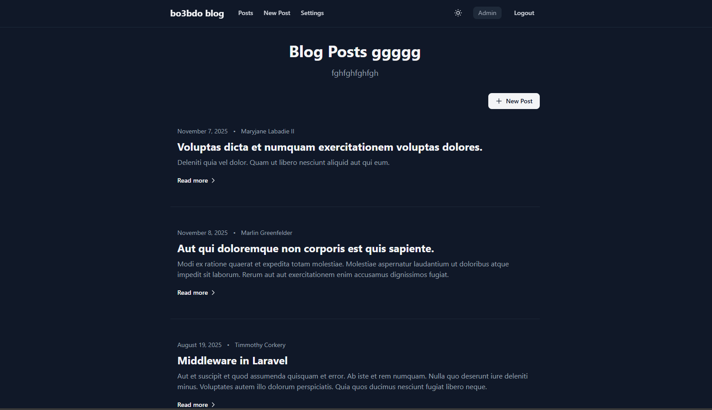
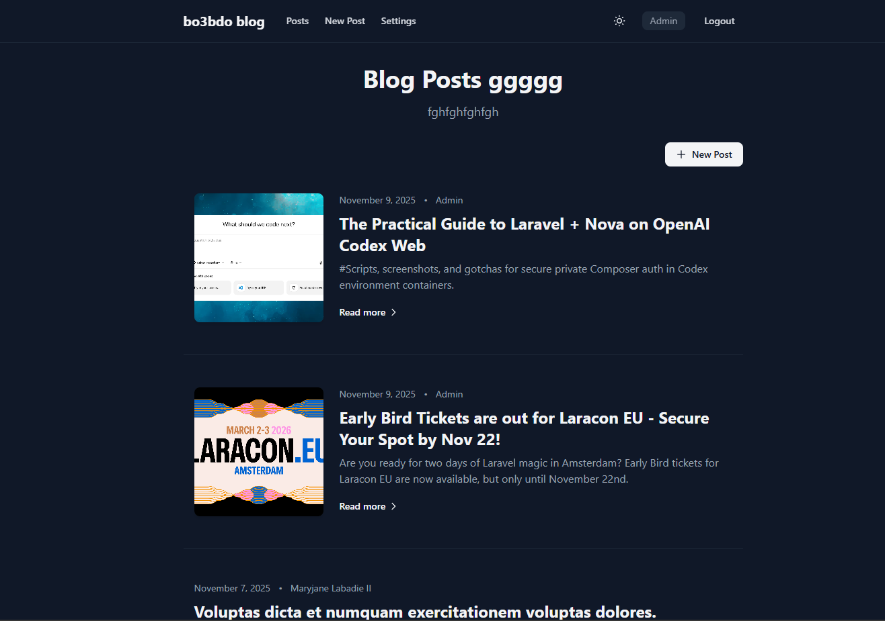
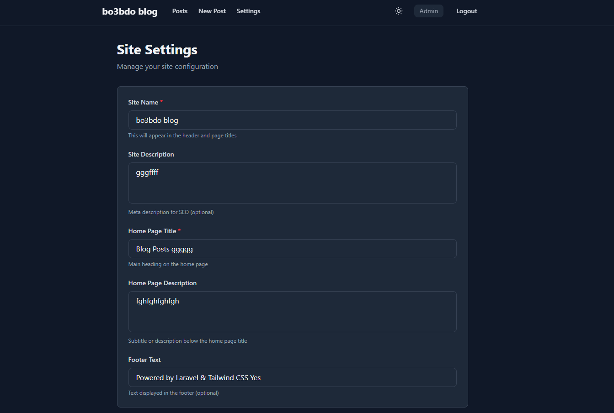

# Laravel Blog with Markdown & Syntax Highlighting

A modern, clean blog application built with Laravel 12, Livewire 3, and Torchlight for beautiful syntax highlighting. Inspired by PaperMod theme design.


## Features

- 📝 **Markdown Support** - Write posts in Markdown with full support for GitHub Flavored Markdown
- 🎨 **Syntax Highlighting** - Powered by [Torchlight](https://torchlight.dev/) for beautiful code blocks
- 🔐 **Authentication** - User registration and login system
- 🛡️ **Authorization** - Users can only edit/delete their own posts
- ⚡ **Livewire 3** - Interactive post creation with real-time validation
- 🎯 **Clean Design** - PaperMod-inspired minimalist design with dark mode support
- 📱 **Responsive** - Fully responsive design that works on all devices
- 🌙 **Dark Mode Toggle** - Manual dark/light mode switching with localStorage persistence
- ✨ **Smooth Animations** - Fade-in effects, hover animations, and smooth transitions
- 🔔 **Toast Notifications** - Beautiful toast notifications for success/error messages
- ⏳ **Loading States** - Loading spinners and disabled states during form submissions
- 📄 **Enhanced Pagination** - Beautiful, accessible pagination design
- ⚙️ **Admin Settings** - Site settings management for administrators (site name, descriptions, etc.)

## Tech Stack

- **PHP** 8.4.11
- **Laravel** 12.37.0
- **Livewire** 3.6.4
- **Tailwind CSS** 4.1.16
- **Torchlight** - Syntax highlighting API
- **CommonMark** - Markdown parser
- **SQLite** - Database (can be changed to MySQL/PostgreSQL)

## Requirements

- PHP >= 8.2
- Composer
- Node.js & NPM
- SQLite (or MySQL/PostgreSQL)

## Installation

1. **Clone the repository**
   ```bash
   git clone https://github.com/yourusername/laravel-blog.git
   cd laravel-blog
   ```

2. **Install PHP dependencies**
   ```bash
   composer install
   ```

3. **Install Node dependencies**
   ```bash
   npm install
   ```

4. **Environment setup**
   ```bash
   cp .env.example .env
   php artisan key:generate
   ```

5. **Configure database**
   
   Update `.env` with your database configuration:
   ```env
   DB_CONNECTION=sqlite
   # Or use MySQL/PostgreSQL
   # DB_CONNECTION=mysql
   # DB_HOST=127.0.0.1
   # DB_PORT=3306
   # DB_DATABASE=blog
   # DB_USERNAME=root
   # DB_PASSWORD=
   ```

6. **Run migrations**
   ```bash
   php artisan migrate
   ```

7. **Configure Torchlight** (Optional but recommended)
   
   Get your API token from [Torchlight.dev](https://torchlight.dev/) and add it to `.env`:
   ```env
   TORCHLIGHT_TOKEN=your_token_here
   ```

8. **Build assets**
   ```bash
   npm run build
   ```

9. **Start the development server**
   ```bash
   php artisan serve
   ```

   Or use the dev script:
   ```bash
   composer run dev
   ```

## Screenshots

<div align="center">

### Home Page


### Dark Mode


### Settings Page



</div>


## Usage

### Creating Posts

1. **Register/Login** - Create an account or login
2. **Create Post** - Click "New Post" in the navigation
3. **Write in Markdown** - Use Markdown syntax for formatting
4. **Add Code Blocks** - Use triple backticks with language identifier:

   ````markdown
   ```php
   <?php
   echo "Hello World!";
   ```
   ````

5. **Publish** - Check "Publish immediately" to publish right away

### Markdown Features

- Headings (`#`, `##`, `###`)
- **Bold** and *italic* text
- Lists (ordered and unordered)
- Links and images
- Code blocks with syntax highlighting
- Blockquotes
- Tables

### Code Highlighting

Torchlight supports all languages that VS Code supports. Simply specify the language in your code block:

- `php` - PHP code
- `javascript` or `js` - JavaScript
- `python` - Python
- `html` - HTML
- `css` - CSS
- And many more...

### UX/UI Features

- **Dark Mode Toggle** - Click the sun/moon icon in the header to switch between light and dark themes. Your preference is saved in localStorage.
- **Smooth Animations** - All pages feature fade-in animations and smooth transitions for a polished experience.
- **Loading States** - Forms show loading spinners and disable buttons during submission to prevent double submissions.
- **Toast Notifications** - Success and error messages appear as elegant toast notifications that auto-dismiss after 5 seconds.
- **Enhanced Interactions** - Hover effects, focus states, and smooth transitions throughout the interface.
- **Responsive Pagination** - Beautiful pagination controls that work seamlessly on all screen sizes.

## Routes

- `GET /` - Redirects to posts index
- `GET /posts` - List all published posts
- `GET /posts/create` - Create new post (requires authentication)
- `POST /posts` - Store new post (requires authentication)
- `GET /posts/{post}` - Show single post
- `GET /posts/{post}/edit` - Edit post (requires authentication & ownership)
- `PUT/PATCH /posts/{post}` - Update post (requires authentication & ownership)
- `DELETE /posts/{post}` - Delete post (requires authentication & ownership)
- `GET /login` - Show login form (guest only)
- `POST /login` - Process login (guest only)
- `GET /register` - Show registration form (guest only)
- `POST /register` - Process registration (guest only)
- `POST /logout` - Logout (requires authentication)
- `GET /settings` - Show settings page (admin only)
- `PUT /settings` - Update site settings (admin only)

## Project Structure

```
app/
├── Http/
│   ├── Controllers/
│   │   ├── AuthController.php    # Authentication logic
│   │   ├── PostController.php    # Post CRUD operations
│   │   └── SettingsController.php # Site settings management
│   └── Requests/
│       ├── LoginRequest.php
│       ├── RegisterRequest.php
│       ├── StorePostRequest.php
│       ├── UpdatePostRequest.php
│       └── UpdateSettingsRequest.php
├── Livewire/
│   └── Pages/
│       └── Post/
│           └── CreatePost.php    # Livewire component for post creation
├── Models/
│   ├── Post.php                  # Post model with Markdown formatting
│   ├── Setting.php               # Settings model with caching
│   └── User.php                  # User model with admin support
└── Policies/
    ├── PostPolicy.php            # Authorization policies for posts
    └── SettingPolicy.php         # Authorization policies for settings

resources/
├── css/
│   └── app.css                    # Tailwind CSS with custom animations
├── js/
│   ├── app.js                     # Main JS entry point
│   ├── dark-mode.js               # Dark mode toggle logic
│   └── toast.js                   # Toast notification system
└── views/
    ├── auth/
    │   ├── login.blade.php
    │   └── register.blade.php
    ├── components/
    │   ├── layouts/
    │   │   └── app.blade.php     # Main layout with dark mode support
    │   └── skeleton-post.blade.php # Skeleton loader component
    ├── livewire/
    │   └── pages/
    │       └── post/
    │           └── create-post.blade.php
    ├── posts/
    │   ├── index.blade.php
    │   ├── show.blade.php
    │   └── edit.blade.php
    └── vendor/
        └── pagination/
            └── tailwind.blade.php # Custom pagination design
```

## Configuration

### Torchlight

Torchlight is configured in `config/torchlight.php`. You can customize:

- Theme (default: `github-dark`)
- Line numbers
- Other highlighting options

See [Torchlight Documentation](https://torchlight.dev/docs) for more options.

### Authentication

Authentication is handled by Laravel's built-in authentication system. Users can:

- Register new accounts
- Login with email/password
- Logout
- Remember me functionality

### Dark Mode

Dark mode is implemented using Tailwind CSS v4's `@custom-variant` feature:

- Toggle button in the header (sun/moon icon)
- Preference saved in browser localStorage
- Auto-detects system preference on first visit
- Smooth transitions between themes
- Works with all Tailwind dark mode utilities (`dark:*`)

The dark mode configuration is in `resources/css/app.css`:

```css
@custom-variant dark (&:where(.dark, .dark *));
```

### Animations & Transitions

The application includes custom CSS animations:

- **Fade-in** - Pages fade in smoothly on load
- **Staggered animations** - Post items animate in sequence
- **Hover effects** - Interactive elements respond to hover
- **Smooth transitions** - All color changes are animated

Custom animations are defined in `resources/css/app.css`.

### Admin Settings

The application includes a settings management system for administrators:

- **Site Name** - Customize the site name displayed in header and page titles
- **Site Description** - Meta description for SEO
- **Home Page Title** - Main heading on the home page
- **Home Page Description** - Subtitle or description below the home page title
- **Footer Text** - Custom footer text

To access settings:
1. Make a user an admin by setting `is_admin = true` in the database
2. Login as an admin user
3. Click "Settings" in the navigation menu
4. Update settings and save

Settings are cached for performance and automatically cleared when updated.

**Making a User Admin:**

```bash
php artisan tinker
```

```php
$user = \App\Models\User::first();
$user->update(['is_admin' => true]);
```

Settings are stored in the `settings` table and can be accessed via `Setting::get('key')` or through view variables shared globally.

## Testing

Run tests with Pest:

```bash
php artisan test
```

## Code Style

This project uses Laravel Pint for code formatting:

```bash
vendor/bin/pint
```

## Contributing

Contributions are welcome! Please feel free to submit a Pull Request.

1. Fork the project
2. Create your feature branch (`git checkout -b feature/AmazingFeature`)
3. Commit your changes (`git commit -m 'Add some AmazingFeature'`)
4. Push to the branch (`git push origin feature/AmazingFeature`)
5. Open a Pull Request

## License

This project is open-sourced software licensed under the [MIT license](https://opensource.org/licenses/MIT).

## Credits

- [Laravel](https://laravel.com/) - The PHP Framework
- [Livewire](https://livewire.laravel.com/) - Full-stack framework
- [Torchlight](https://torchlight.dev/) - Syntax highlighting
- [Tailwind CSS](https://tailwindcss.com/) - Utility-first CSS framework
- [PaperMod](https://github.com/adityatelange/hugo-PaperMod) - Design inspiration

## Support

If you have any questions or issues, please open an issue on GitHub.

---

